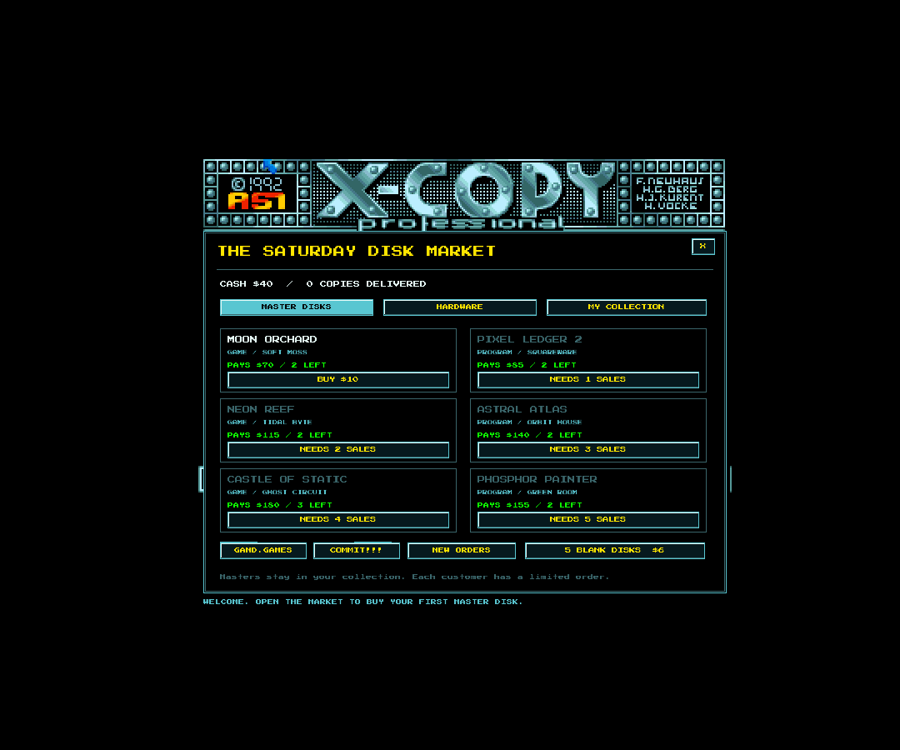

# G Copy — the floppy disk business

**Play free in your browser: [g-copy.gand.games](https://g-copy.gand.games)** — no install, progress is saved between visits.

A [Gand Games](https://gand.games) release.



A small disk-copying business inside a classic Amiga copier interface, made as a
loving homage to X-Copy. Begin with one
internal drive, 512 KB RAM, $40 and three blank disks. Buy imaginary game and
program masters at the Saturday market, fulfil customers' copying instructions,
verify the destination and get paid. Spend your earnings on RAM and external drives.

## Run the desktop version

The browser version above is the easiest way to play. To run it natively,
install [LÖVE 11.5](https://love2d.org), then:

```sh
git clone https://github.com/gandtr/g-copy.gand.games.git
love g-copy.gand.games
```

On macOS you can also `cd` into the clone and double-click `play.command`.
Everything is offline and uses imaginary disks; the game never
reads, copies or modifies your real drives or software.

## Your first order

1. In MARKET, buy **Moon Orchard** for $10. Read DISK INFO; it needs tracks 00-79,
   BOTH sides. Those are the starting settings.
2. Close the order panel. DF0's top and bottom bulbs are lit: the same physical
   drive is both source and target. The master is inserted automatically on purchase.
3. Click START. Yellow zeros are data held in RAM. Only 448 KB is available to
   the copy buffer because 64 KB is reserved for the copier. An 880 KB disk needs
   two batches. The game requests **destination, source, destination** as it works.
4. Click the insertion prompt or press Enter at each swap. A destination is reused
   for the second write batch; only one blank disk is consumed per finished copy.
   Green zeros indicate tracks written to the destination.
5. Click **PRUEFEN / CHECKDISK** to verify, or click the already-lit target bulb
   once before START to mark it **V** for automatic verification. Click the
   **VERIFIED status message** or press Enter to deliver and receive $70.
6. **NOCHMAL** makes another copy for the same customer. The first customer orders
   two copies. Buy new masters as your reputation unlocks them, or use **NEW ORDERS**
   in the market to renew sold-out titles already on your shelf.

There is no global arcade countdown now. Drive time is recorded, and turbo is a
way to work faster. The challenge comes from choosing the right copy parameters,
handling media, recovering weak reads and improving your setup.

## Every control has a job

| Control | Operation |
| --- | --- |
| COPY / mode value | Cycle DOSCOPY, DOSCOPY+ and NIBBLE; minus cycles backwards |
| START / END track values | Click the value and type 00-79; Enter applies it. +/- adjusts by one; the range panel also has +/-10 |
| SIDE | BOTH, UPPER or LOWER; changes the actual side-tracks copied |
| SYNC | 4489, A245 or 8914; required by some protection puzzles |
| TOOLS > TRACK RANGE > TRACK LENGTH | NORMAL or LONG; affects long-track reads and buffer capacity |
| UEBER / DISK / RAM (original upper-right field) | DISK streams between separate drives; RAM stages the copy through the buffer |
| Top bulb above a drive | Select source drive |
| Bottom bulb below a drive | OFF → lit COPY bulb → original orange V bulb → OFF. Each destination cycles independently |
| Drive picture | Insert master, insert destination, eject or select its role; disconnected drives open the hardware shop |
| START | Start, resume, retry a blocked operation or confirm a requested swap |
| NOCHMAL | Retry a blocked read or repeat the current master; reuse a complete cached image when possible |
| STOP | Pause/resume without losing the buffer |
| DISK INFO | Customer instructions, protection hints, required tracks and memory capacity |
| INHALT | Purchased master collection |
| PRUEFEN | Verify a finished copy or diagnose the current blocked track |
| ZURUECK | Restore standard copy settings |
| TOOLS | Market, hardware, track length, buffer settings, verify, retry, disk information, format, abort, status, help, credits and audio |
| Track grid cell | Inspect its state, or retry the currently blocked track |
| Original header/logo | Credits |
| MARKET / tabs / cards | Buy masters, hardware, blanks; load owned masters; renew sold-out orders |
| VERIFIED status message / Enter | Deliver all verified matching copies in the batch; each pays once |
| Shift | Hold to accelerate; release to cool the motor |
| TOOLS > MUSIC / SFX | Independent audio switches |

Operations lock routing and track-range changes while data is in flight. Mode,
sync and length can be corrected at a blocked track; NOCHMAL resumes it. To restart
with a different range, use TOOLS > ABORT or finish and repeat.

Select one source and up to three external targets. Each source track is read once
and written to every selected destination in parallel. Each target needs one blank
and one remaining customer order. START rejects a batch if either is insufficient,
without spending any blanks. Media prompts load the destinations in drive order.

Click an unlit target bulb once for **COPY**, twice for **V**, three times to switch
it off. V starts a real verification pass as soon as copying finishes. In a mixed
COPY/V batch, only V targets verify automatically; PRUEFEN checks the rest. All
copies must match the order and pass verification before the batch can be delivered.
Click a drive to inspect its verification status. Selecting an external target turns
off the source drive's target role; selecting the source as target returns to a
single-drive swap operation. Installed new drives start with their target bulb off.

The original desk is restored in full. Open the market through **TOOLS > MARKET**
or **B**; click the green status strip for the operation report and business totals.

Keyboard: **Tab / Shift+Tab** selects any visible control and **Enter** activates it.
With no control selected, **Enter** starts/swaps/delivers; **Space/R** retries or repeats; **P**
pauses; **V** verifies; **B** market; **I** disk info; **H** help; **C** credits;
**M/S** audio; **Shift** turbo; **F11** fullscreen; **Escape** cancels calibration,
closes a panel or pauses. Window focus loss pauses the motor.

## Orders and protection puzzles

Nine fictional titles mix full copies, selected track ranges, one-sided orders,
custom sync words, long tracks and weak reads. For example:

- **Pixel Ledger 2:** tracks 12-39, UPPER only. Copying extra tracks fails verification.
- **Neon Reef:** custom headers require NIBBLE and a retry.
- **Astral Atlas:** lower-side star charts with the A245 sync word.
- **Castle of Static:** a long-track gate requires NIBBLE and LONG length.
- **Copper Courier:** combine NIBBLE, sync 8914 and LONG length.
- **Phosphor Painter:** recover weak reads with timed calibration or DOSCOPY+.

Red **2** indicates a sync problem, **5** a custom-header problem, **6** a weak
checksum read and **7** a long track in these game puzzles. On error 6, NOCHMAL opens
calibration: press Space in green; hitting near the centre gives a perfect. Five missed
calibrations fail that attempt. DOSCOPY+ handles weak reads automatically at a
slower speed; it does not solve custom headers or sync/length problems by itself.
These are game abstractions, not instructions for a real copier or real protection.

## Upgrades and persistence

- 1 MB RAM gives 960 KB usable: one whole standard disk fits. One-drive copying
  needs one destination insertion, and NOCHMAL can reuse the cached image.
- Long tracks use more buffer space; 2 MB RAM can retain a complete long-track image.
- DF1 enables direct source-to-destination copying, with no alternating media swaps.
  DF2 and DF3 enable two and three simultaneous target copies.
- Masters are purchased once; every delivered copy has a customer payment. Blank
  five-packs cost $6. NEW ORDERS renews sold-out owned titles without resetting
  lifetime deliveries or charging for the master again.

Business progress and audio preferences save atomically as non-executable text to
`business.dat` in LÖVE's per-user save directory; the browser build keeps them in
the site's local storage instead.
Old `scores.dat` audio preferences migrate automatically. **Active copy progress
restarts after quitting**; purchased masters, cash, hardware, stock and delivered
orders remain saved. A blank already inserted into an interrupted copy remains used.

## Visuals and audio

Success marks are hollow **green zeros**, verified against the X-Copy Shrine's
error reference and a photograph of the original completed-copy screen. The
**complete original 1992 bitmap** supplies the logo, German labels, borders,
arrows, floppy icons, grids and black margins. Transparent hit regions keep the
original artwork clickable. Live settings and results are overlaid in place.
The source bitmap also supplies the OFF, lit COPY and orange V bulb sprites.
Existing yellow glyphs are sampled from the original; additional characters use
matching pixel geometry. New market and game dialogs remain separate pop-ups.
The desk and dialogs scale to the available viewport with nearest-neighbour
filtering. Unused bitmap margins are cropped from the view; all original controls
and dialog content remain visible. High-DPI rendering and pointer coordinates
follow the same transform on desktop and touch screens.

Disk swaps now play actual **Amiga 600 ejection and insertion recordings**, by
asie, CC0, in sequence. Empty-drive insertion plays only the insert; eject plays
only the eject. Invalid media actions remain silent. SFX mute cancels queued sounds;
the music and motor duck while the media mechanism plays. The original UAE A500
motor/head recordings and Holizna's CC0 **Adventure Begins Loop** remain bundled.
See [asset provenance](docs/ASSETS.md) for sources and individual licenses.

## Web build (g-copy.gand.games)

The browser build uses [love.js](https://github.com/Davidobot/love.js) 11.4
(WebAssembly, pinned by `package-lock.json`) and deploys to GitHub Pages:

```sh
npm ci                  # one-time, installs the pinned love.js runtime
bash build_web.sh       # packages the game and emits dist/web
python3 serve.py        # local test at http://localhost:8000 (COOP/COEP headers)
```

`build_web.sh` reuses `scripts/build.py`, injects the localStorage save bridge
(`tools/inject_bridge.js` + `web_template/storage-bridge.js`, which also handles
the atomic `business.tmp` → `business.dat` rename), installs the
coi-serviceworker shim GitHub Pages needs for cross-origin isolation, and
writes `CNAME` (g-copy.gand.games) and `.nojekyll`. The whole site is ~10 MB,
well inside Pages limits.

Pushes to `main` deploy via `.github/workflows/deploy-pages.yml`. One-time
setup: repo Settings → Pages → Source "GitHub Actions", and a DNS CNAME record
for `g-copy.gand.games` pointing at `gandtr.github.io`.

love.js notes: `love.system.openURL` maps to `window.open` (studio link
buttons work in-browser); `Storage.load` guards with `getInfo` because reading
a missing file hangs this runtime; audio starts after the first user gesture
per browser autoplay rules.

## Develop and verify

```sh
npm test                # Lua tests + JavaScript save-bridge regressions
XCOPY_SMOKE=1 LOVE_SHOT=1 love .
XCOPY_DEMO=complete LOVE_SHOT=1 love .
python3 scripts/build.py
```

51 deterministic tests cover memory, swaps, routing, verification, protection,
economy, upgrades, repeat caching, saves, and all nine orders. The real LÖVE smoke
test clicks rendered controls, types a range, completes/validates/sells a copy,
repeats it, buys hardware, selects multiple targets, auto-verifies and sells a batch,
and checks the sequential insert/eject audio and mute behavior. A pixel test compares
the static screen and all three bulb states against the original bitmap.

Browser regression tests complete three real copy/verify/deliver playthroughs at
desktop, mobile landscape and mobile portrait sizes, reload saved progress, check
fullscreen and resizing, and recover a save with IndexedDB disabled:

```sh
npx playwright install chromium
bash build_web.sh
python3 serve.py         # leave running in another terminal
npm run test:web
```

GitHub Pages deployment runs the Lua, save-bridge and browser tests before
publishing. Screenshots are written under `screenshots/audit-web/`.

Screenshot fixtures: `market`, `hardware`, `info`, `range`, `play`, `swap`,
`protection`, `retry`, `complete`, `classic`, `multi`, `multi_complete`. `XCOPY_SEED` fixes the random calibration window.
Test/demo sessions never write the user's business save.

The build script creates a `.love` and macOS launcher in `dist/`, verifies archive
CRCs and compares all bundled files against their source bytes. `--output PATH`
selects another destination. Browser deployment is covered in the web build
section above.

`Game.lua` owns business/media state; `Operation.lua` implements copying and
verification; `Catalog.lua` defines fictional jobs/upgrades; `App.lua` dispatches
input; `Skin.lua`, `UI.lua`, `Overlay.lua` render the desk and market; `Storage.lua`
owns save serialization. The original arcade version remains in Git history.
